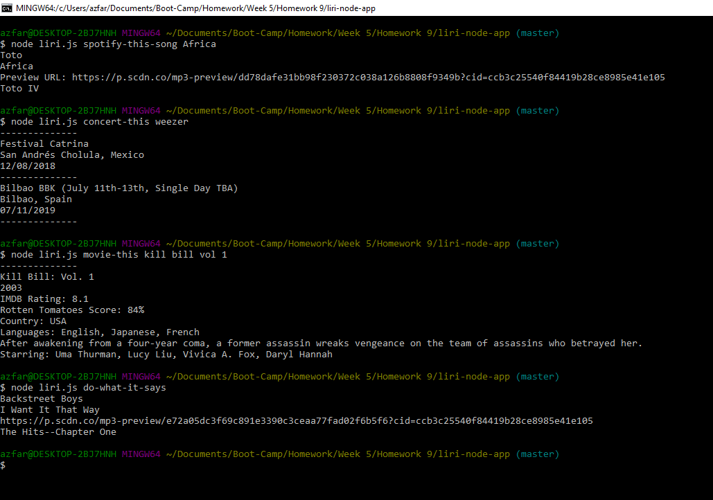

# liri-node-app
The Liri Node App is an entirely back-end application that allows users to inquire about movies, songs, and musicians. This back-end application will then use certain node packages to hit the necessary APIs required to fulfill the users request. The requests are made and the responses are logged into the user's terminal, with no need to use a browser.

# Images


# Prerequisites
- [node.js](https://nodejs.org/en/)
- [Git Bash](https://git-scm.com/downloads)

# Installation guide
- First you will need to download this folder to your computer. You may do this either by downloading the document as a zip file, or by cloning the git repository to a folder on your computer using Git Bash. In order to do this, click the green button labeled "Clone or Download", and select your method of retrieving the file.
- If you want to use the git clone method, your first step is to copy the link provided. From here you want to navigate to the desired location on your computer in your Git Bash terminal, or navigate to the desired location via your explorer, right click and select "Git Bash Here". Within your Git Bash terminal, type the following: 
`git clone https://github.com/aehaq/liri-node-app.git`
- Once the repository exists locally on your computer, navigate to within the newly downloaded folder using git bash, or use the "Git Bash Here" method to open the terminal within the correct folder.
- To ensure you are in the correct folder, type the following and hit enter: 
`ls`
- If succesful, all non-hidden documents and folders within your location should be listed. If this includes a file named 'liri.js', you are in the right place.
- Finally, you will need to ensure that all of the required npm packages are installed. Type the following phrase into your Git Bash terminal: 
`npm i`
- If succesful you should see a progress bar within the Git Bash terminal indicating installation progress. Once the instillations are complete, you are ready to run the app.

# Use
To get liri bot to perform searches for you, you need to make sure you have your Git Bash terminal open and looking at the correct folders. When you are within the correct location, you may type the following commands to ask her for information:

(Note: Do not actually type out the brackets, just type out your search query directly) 

1. `node liri.js concert-this <artist/band name here>`

This command will tell Liri to search for any upcoming events featuring the artist or band you asked her about.

2. `node liri.js spotify-this-song <song name here>`

This command will tell Liri to search for information regarding the song you asked her about. This includes a song preview url, if available.

3. `node liri.js movie-this <movie name here>`

This command will tell Liri to search for some basic information regarding the movie you asked her about.

4. `node liri.js do-what-it-says`

This command will tell Liri to search spotify for "I want it that way" by Backstreet Boys.

# Technology Used
- JavaScript
- Moment.js
- Node.js
- APIs (Spotify, OMDB, Bands-in-town)
- NPM (Node Packet Manager)
- dotENV

# Code Snippets
```
function spotifyThis() {

    var input;
    var array = process.argv
    if (process.argv[3]) {
        input = process.argv[3];
        //If the user writes a track name with multiple words, they will be appended here.
        for (let i = 4; i < array.length; i++) {
            input += " " + array[i]
        }
    } else {
       ...
    }
    //Search the spotify api 
    spotify.search({ type: 'track', query: input }, function(err, data) {
   ...
```
The logic above was used in multiple functions to generate a readable search query from multi-word inputs in the node terminal. Because each string was its own unique item within the process.argv array. A for loop was required to append all words post search query into a single string that aligned with the format required by the specific node package used to call the document.

# Learning Points
- Using export to communicate between multiple javascript files.
- Handling and importing secret keys using the .ENV node package.
- Using node to handle API calls instead of AJAX.
- Installing NPM node files.
- Using the process.argv command alongside for loops to generate search queries.
- Using the fs node package to read search queries from text files.

# Author 
Azfar Haq - [GitHub](https://github.com/aehaq)

# License
Standard MIT License
